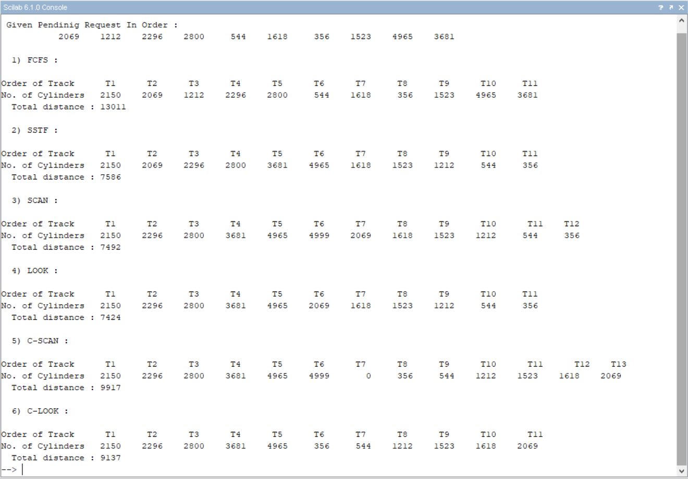

## Distance (in cylinders) for Disk Scheduling Algorithms using [Scilab](https://www.scilab.org/)

This is the Scilab Code solution to Problem 10.11, Chapter 10 - Mass Storage Structure, Operating System Concepts (Book) by Abraham Silberschatz.

### Problem 10.11:

Suppose that a disk drive has 5,000 cylinders, numbered 0 to 4,999. The drive is currently serving a request at cylinder 2,150, and the previous request was at cylinder 1,805. The queue of pending requests, in FIFO order, is:

            2,069, 1,212, 2,296, 2,800, 544, 1,618, 356, 1,523, 4,965, 3681

Starting from the current head position, what is the total distance (in cylinders) that the disk arm moves to satisfy all the pending requests for each of the following disk-scheduling algorithms?

  1.  FCFS
  2.  SSTF
  3.  SCAN
  4.  LOOK
  5.  C-SCAN
  6.  C-LOOK

### Solution:

### Steps of Code Execution:

1. Clone / Download this [repository](https://github.com/nikita9604/Distance-in-cylinders-for-Disk-Scheduling-Algorithms)
2. Open Scilab and Run the main file - [Ex_10_11.sce](https://github.com/nikita9604/Distance-in-cylinders-for-Disk-Scheduling-Algorithms/blob/main/Ex_10_11.sce)
